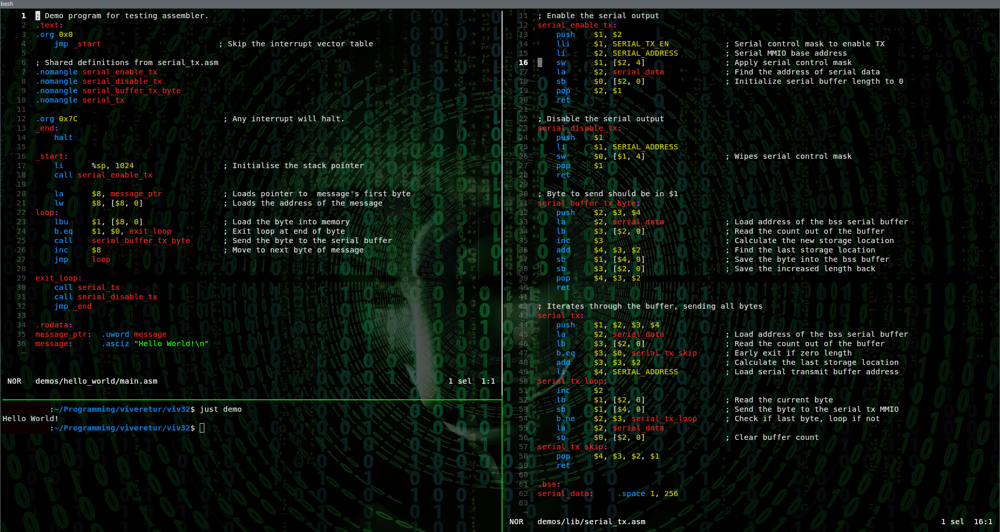

# VIV-32

*For illustrative purposes only*

A custom computer architecture project implementing:

- an ISA specification;
- a reference emulator;
- a QEMU target (TODO);
- a Verilog/SystemVerilog implementation (TODO);
- an assembler/linker toolchain;
- firmware and diagnostics;
- historical programming language experiments.

## Current Status

For the current development plan, see [TODO.md](TODO.md).

## Quick start

Common commands are defined in `justfile`. To build and run the default VIV-32 demo:

```bash
just --list

just demo
```

## Documentation

- `docs/architecture/`
- `docs/platform/`
- `docs/abi/`
- `docs/toolchain/`

## Major Components

- `demos/` — capability demonstration programs
- `spec/` — machine-readable architecture definitions
- `emulator/` — reference emulator
- `hdl/` — hardware implementation
- `toolchain/` — assembler, linker, disassembler
- `firmware/` — boot code, monitor, diagnostics
- `tests/` — conformance tests

## Screenshot



## Licence

This project is experimental and provided as-is. It is not production hardware, security, safety, or compliance tooling.

See [LICENSE](LICENSE).

